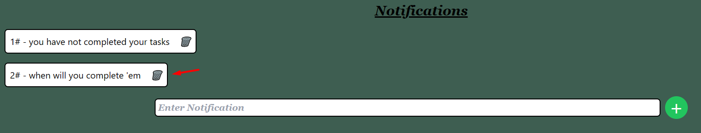

# Learning Management System

### <i> Dashboards</i>

* <i>Login Page for the Application</i><br>
<br>
* <i>User Dashboard</i><br>
<br>
* <i>Admin Dashboard - Display # 01</i><br>
<br>
* <i>Admin Dashboard - Display # 02</i><br>
<br><br>

### <i>Run On Your System</i>

* <i>A Fully Functional and integrated leraning management system.</i>
<i>

```
git clone https://github.com/mhuzaifi0604/Learning-Management-System
```

```
cd Local_API_Server
node Server.js
```

```
cd LMS
npm install
npm run dev
```

<strong>Test Emails & Passwords</strong>

* For Admin

```
Email:    admin@lms.com
Password: admin@123
```

* For User

```
Email:    abc@gmail.com
Password: 123456
```

</i>

* <i>Addition of a new User</i><br>
      <i>Details as you can see in the screenshot below:</i><br>
<br>
      <i>New User Has been added</i><br>
<br>

* <i>Click on the <strong>Pencil</strong> icon to view details as shown below:</i><br>
<br>

* <i>Again click on pencil icon to change user details</i><br>
<br>
      <i>As you can see in the screenshot below, name of user has been updated</i><br>
<br>

* <i>If you click the <strong>+</strong> icon in the details page you will get tasks and notifications page</i><br>
<br>

* <i>you can <strong>add & delete</strong> tasks and notification as well</i><br>
<br>
<br>
<br>\

* <i>Now that we have added tasks and notofications lets head back to the User Dashboard</i><br>
<br>
<i>we can see the updated tasks and notifications in the chat feature as shown above in the screenshot.</i><br>

* <i>Now if you want to move the tasks b/w <strong>To Do, Doings and Dones </strong>you can use the buttons in front of each task</i><br>
        <li><strong>⏩</strong> <i>for moving tasks to the Done Section.</i>
        <li><strong>✔ </strong><i>for moving tasks to the Doings Section.</i>
        <li><strong>◀ </strong><i>for moving tasks from Dones back in doings section as shown in the screenshots below</i><br>
<br>
<br>

* <i>Now if you want to add any notification from user panel, as you can see below:</i><br>
<br>

* <i>Here is the added notification</i><br>
<br>

* <i>In the above screenshots where i moved the tasks, you could see a <strong>clear button</strong> at the end of dones section, clicking on the button clears all the tasks from the dashboard as you can see below:</i><br>
<br>
* <i>Another Page appears when you click on <strong>settings</strong> button, you will get to see soemthing like this</i><br>
<br>
* <i>Clicking on <strong>update</strong> button will update the password and now if you logout and then login with old password you won't be able to login as you can see in the screenshot below.</i><br>
<br>
* <i>Another amazing feature is the <strong>enable and disable</strong> of user theough admin dashborad<i><br>
<br>
* <i>Now, if i let you see the Local server API, you can see the users disabled status</i><br>
<br>
* <i>And if you try to login now even with the new password, you won't be able to login in to the user dashboard as shown in the screenshot below:<br></i>
<br>

<strong><i>This application was developed using multiple frontend and backend techniques like React routers, private routes, dynamic paging, node servers for Local APIs using axios interceptors and firebase authentication for admin ensuring application performance, availability and user security.</i></strong>
